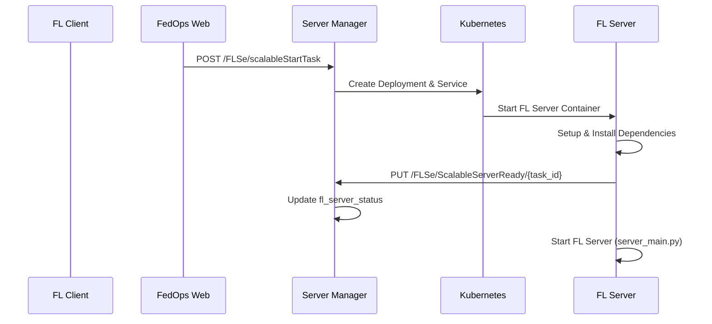
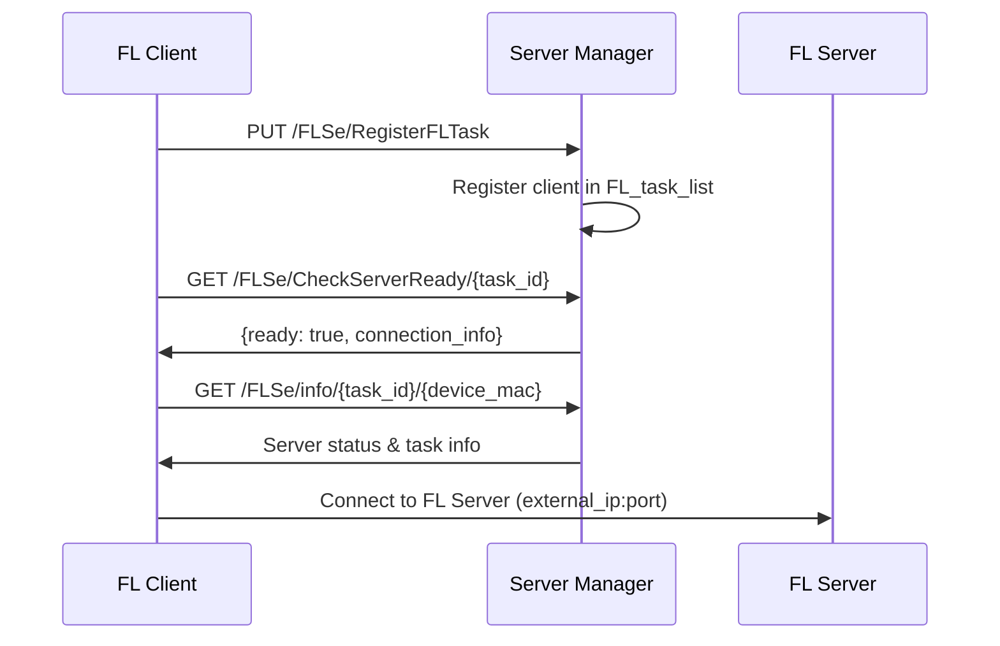
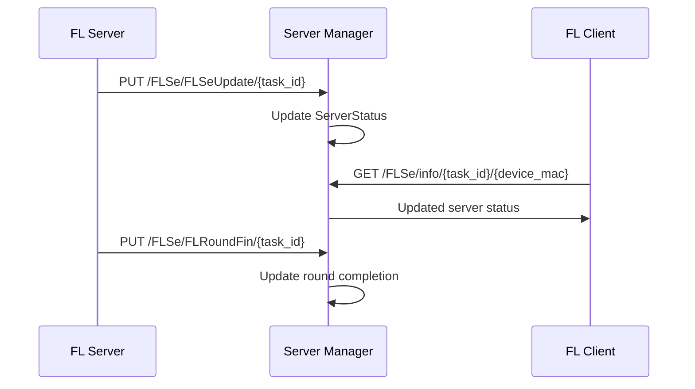

# Scalable Server와 Server Manager 연동 가이드

## 🚀 개요

이 문서는 `scalable_server_operator`로 생성된 서버가 `server_manager`의 클라이언트 등록 및 관리 시스템과 어떻게 연동되는지 설명합니다.

## 📋 주요 변경사항

### 1. Scalable Server 생성 시 연결 정보 설정

**`scalable_server_operator.py`** 수정사항:
- 서버 생성 시 `SERVER_MANAGER_URL` 환경변수 추가
- FL 서버 자동 시작 및 Server Manager 알림 기능 추가
- 외부 IP와 포트 정보를 `fl_server_status`에 저장

```python
# 환경변수에 Server Manager URL 추가
client.V1EnvVar(name="SERVER_MANAGER_URL", value="http://server-manager.fedops.svc.cluster.local:8000"),
client.V1EnvVar(name="FL_SERVER_MODE", value="scalable"),
```

### 2. 서버 상태 관리 API 추가

**`app.py`**에 추가된 API들:

#### `/FLSe/ScalableServerReady/{task_id}` (PUT)
- Scalable FL 서버가 준비 완료되었음을 알리는 API
- FL 서버 컨테이너가 시작 시 자동으로 호출

#### `/FLSe/CheckServerReady/{task_id}` (GET)
- 클라이언트가 서버 준비 상태를 확인하는 API
- 연결 정보 포함하여 반환

#### `/FLSe/getConnectionInfo/{task_id}` (GET) - 개선
- Scalable 서버의 연결 정보 반환
- `server_address` 필드 추가로 클라이언트 연결 편의성 향상

### 3. 클라이언트 관리 API 개선

#### `/FLSe/GetAvailableClients/{task_id}` (GET)
- 특정 태스크의 사용 가능한 클라이언트 목록 반환
- 온라인/훈련 상태 통계 포함

#### `/FLSe/StartFLWithSelectedClients/{task_id}` (POST)
- 선택된 클라이언트들과 FL 시작
- `server_type: "scalable"` 지원

## 🔄 연동 워크플로우

### 1. Scalable 서버 생성 및 시작



### 2. 클라이언트 연결 프로세스



### 3. 상태 동기화



## 🌐 네트워크 구성

### 서비스 및 포트 관리

1. **LoadBalancer Service**: 각 태스크별 고유 서비스 생성
2. **Istio VirtualService**: 외부 접근을 위한 라우팅 설정
3. **포트 할당**: 40026-40039 범위에서 자동 할당
4. **외부 IP**: LoadBalancer를 통한 외부 접근 제공

### 연결 정보 구조

```json
{
  "task_id": "my-fl-task",
  "status": "FL Server Running",
  "port": 40026,
  "external_ip": "1.2.3.4",
  "server_type": "scalable",
  "server_address": "1.2.3.4:40026",
  "deployment": "fl-server-deploy-my-fl-task",
  "service_name": "fl-server-service-my-fl-task"
}
```

## 📊 클라이언트 관리

### 클라이언트 등록

```python
# 클라이언트 자동 등록
@app.put("/FLSe/RegisterFLTask")
def register_fl_task(task: FLTask, request: Request):
    # FL_task_list에 클라이언트 정보 저장
    # 클러스터 정보 유지
```

### 상태 조회

```python
# 클라이언트별 상태 조회
@app.get("/FLSe/info/{task_id}/{device_mac}")
def read_status(task_id: str, device_mac: str):
    # 서버 상태와 클라이언트 태스크 상태 반환
    # 클러스터 정보 포함
```

## 🔧 설정 및 사용법

### 1. Scalable 서버 생성

```javascript
// Frontend에서 scalable 서버 생성
const result = await serverControlAPI.createScalableServerWithConfig(taskId, {
  task_id: taskId,
  server_repo_addr: "https://github.com/gachon-CCLab/FedOps-Training-Server.git",
  data_type: "Image",
  model_type: "CNN",
  strategy: "FedAvg",
  // ... 기타 FL 설정
});
```

### 2. 클라이언트 연결 확인

```python
# 클라이언트가 서버 준비 상태 확인
response = requests.get(f"{SERVER_MANAGER_URL}/FLSe/CheckServerReady/{task_id}")
if response.json()["ready"]:
    connection_info = response.json()["connection_info"]
    fl_server_address = connection_info["server_address"]
    # FL 서버에 연결
```

### 3. 선택된 클라이언트로 FL 시작

```javascript
// 특정 클라이언트들과 FL 시작
const result = await serverControlAPI.startFLWithSelectedClients(
  taskId, 
  ["device_mac_1", "device_mac_2"], 
  "scalable",  // 서버 타입
  flConfig
);
```

## ⚠️ 주의사항

1. **포트 범위**: 40026-40039 범위를 사용하므로 동시 실행 가능한 태스크 수는 14개로 제한
2. **외부 IP**: LoadBalancer 서비스의 외부 IP 할당 시간이 필요할 수 있음
3. **리소스 관리**: PVC를 사용하므로 데이터는 영속적으로 보존됨
4. **네트워크 정책**: Istio 및 Kubernetes 네트워크 정책 확인 필요

## 🐛 트러블슈팅

### 1. 서버 연결 실패
```bash
# 서버 상태 확인
curl -X GET "http://server-manager:8000/FLSe/CheckServerReady/{task_id}"

# 로그 확인
kubectl logs -n fedops -l task_id={task_id}
```

### 2. 클라이언트 등록 실패
```bash
# 클라이언트 목록 확인
curl -X GET "http://server-manager:8000/FLSe/GetAvailableClients/{task_id}"

# 서버 매니저 로그 확인
kubectl logs -n fedops deployment/server-manager
```

### 3. 포트 할당 문제
```bash
# VirtualService 상태 확인
kubectl get virtualservice -n fedops fedops-virtualservice -o yaml
```

이러한 연동을 통해 scalable 서버도 기존의 server_manager 클라이언트 관리 시스템을 그대로 활용하면서, 향상된 확장성과 리소스 관리 기능을 제공할 수 있습니다.
